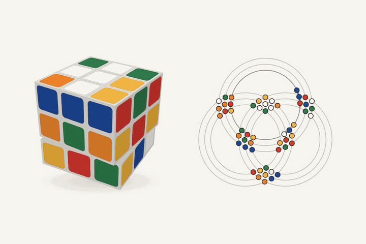
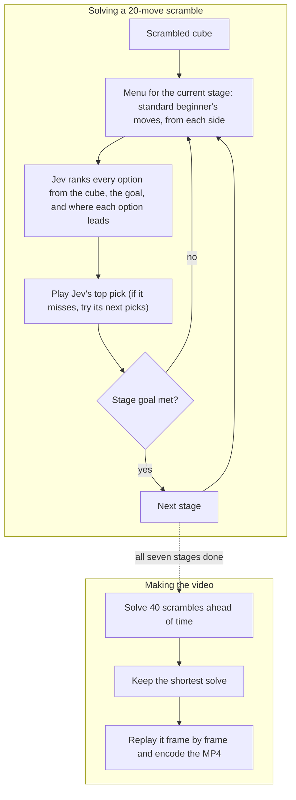
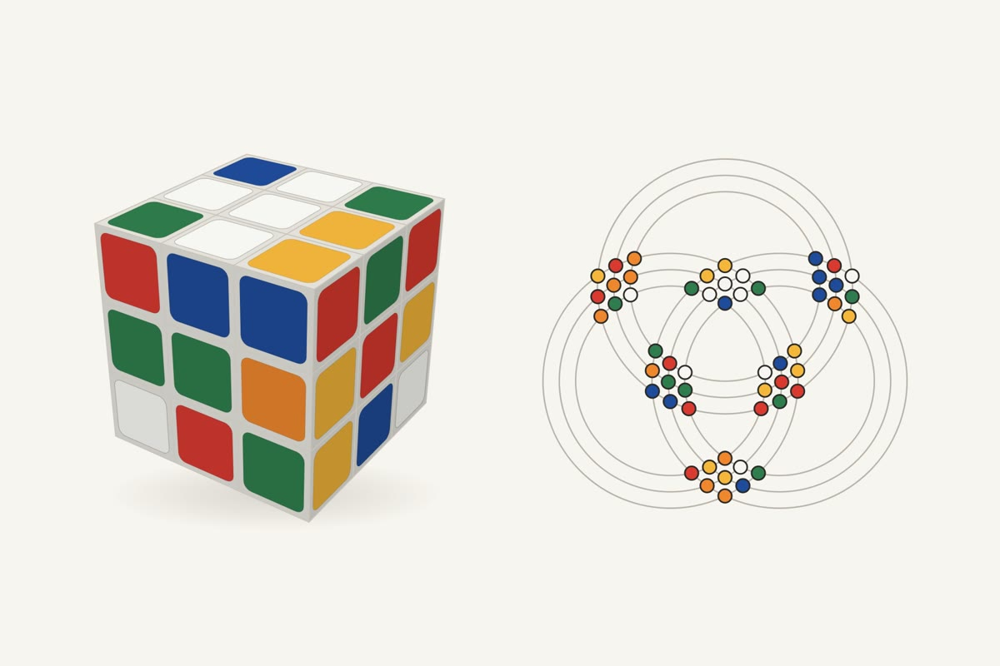
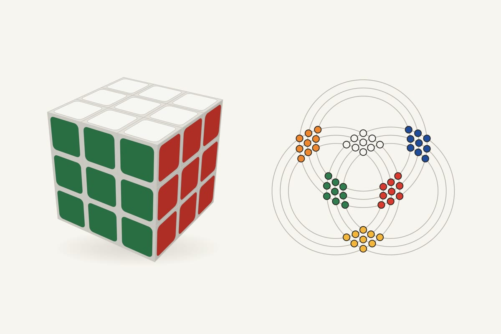

<h1 align="center">Jev vs. the Cube</h1>

<p align="center"><b>A model that never writes a word, solving a Rubik's Cube.</b><br>
TypeSafe AI's Jev only picks from options. Given a real 20-move scramble, it picks every step of the beginner's method until the cube is solved.</p>

<p align="center">
  
</p>

## How it works

1. **The cube.** An exact model of all 54 stickers. Every move Jev picks is applied to it.
2. **The menu.** The beginner's method in seven stages: white cross, white corners, middle layer, yellow cross, yellow edges, place the yellow corners, twist them. Each stage offers the standard moves people learn for it, applied from each side: 5 to 51 options.
3. **Jev picks.** Jev sees the cube, the stage goal, and where every option would leave the cube, then ranks the options. Its top pick is played. If that misses, a small search tries its next few picks.
4. **The check.** Code only confirms when a stage goal is met. It never suggests a move.

Jev runs through the [Vercel AI Gateway](https://vercel.com/ai-gateway/models/jev). A full solve takes 18 to 106 calls and costs a few cents at most.

## System design

Jev chooses every step. The method only decides which options are on the menu, and the check only says when a stage is done.



## Results

| | Solved |
|---|---:|
| **Jev with the beginner's method, 40 fresh 20-move scrambles** | **37 of 40** |
| Same setup, random picks instead of Jev | 0 of 10 |
| Jev alone, 3 moves from solved | 100% |
| Jev alone, 4 moves from solved | 86% (43 of 50) |
| Jev alone, 5 moves from solved | 45% |

Random picks never get past the middle layer, and 8 of 10 stall on the white cross, so the solve comes from Jev's judgment. Jev's three misses got stuck on the last stage. Its solves ran 98 to 233 moves and took 6 to 73 seconds.

On its own, one turn at a time, Jev can't see far enough ahead: past 3 moves from solved, the right turn and a wrong one leave the cube looking equally scrambled. That is why the method is there. People can't plan 20 moves ahead either.

## What made it work

- **Stopping the loop.** The first version asked Jev for one turn at a time and got stuck undoing its own move forever (`L L' L L'`), because the undo always looked closer to solved. Never revisiting a position fixed the loop but not the skill.
- **JSON faces.** Jev read the cube best as JSON face strings. Compact strings, piece lists, and batched scores all did worse.
- **A menu, not raw turns.** Given 234 two-turn sequences, Jev ranked the right one around #20 to #40. Given 43 standard moves plus a one-line note of where each piece sits, it put a right one in its top 3 in 10 of 10 checks.
- **Visible progress.** The white cross cost the most calls, because an edge needs a drop, a turn, and a lift before anything matches. Splitting each edge into two one-step checkpoints took the cross from 8 of 10 at 24 calls to 10 of 10 at 6 calls.

## The video

The solve was done ahead of time with Jev, then replayed at an even pace: the shortest of the 40 runs, 98 moves (86 on screen after merging back-to-back turns of the same face).

The ring graph puts all 54 stickers on three families of circles, one per axis. Each face turn slides 12 stickers along one circle, and each face shows up as a cluster where two families cross. Rendered frame by frame at 1800x1200 and 60 fps.

<p align="center"> </p>

## Run it

Needs Node.js 22.13 or newer and a [Vercel AI Gateway](https://vercel.com/ai-gateway) key.

```powershell
npm install
$env:AI_GATEWAY_API_KEY="your-key"
npm run dev    # http://localhost:3000
```

Pick 20 and press Space to scramble, then Space again to watch Jev solve it. P replays the last solve, H hides the controls, and dragging orbits the cube. The 2, 3, and 4 settings run Jev alone on short scrambles.

To make a video, pre-solve some scrambles and render the shortest one (the dev server must be running, and ffmpeg must be installed):

```powershell
node --experimental-strip-types scripts/make-run.mjs 700-739 5
python scripts/render.py 720 60 renders/jev-cube-720.mp4
```

| Folder | What's in it |
|---|---|
| [`app/`](app/) | the page, the Jev API route, the cube model, the 3D cube and ring graph, the method and the solver |
| [`scripts/`](scripts/) | benchmarks, pre-solving runs, rendering the video |
| [`research/`](research/) | the experiments behind the results |
| [`results/`](results/) | raw benchmark rows |
| [`public/runs/`](public/runs/) | every solved run from the batch of 40 |
| [`tests/`](tests/) | cube math, ring layout, search, and the method menus (`npm test`) |

## Credits

Jev by [TypeSafe AI](https://www.typesafe.ai), called through the [Vercel AI Gateway](https://vercel.com/ai-gateway/models/jev). The app runs on [vinext](https://github.com/cloudflare/vinext), Next.js on Vite.
