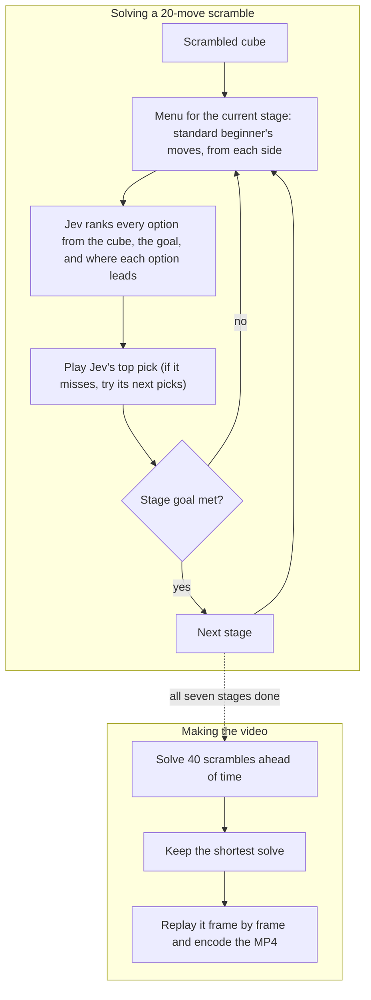

<h1 align="center">Jev vs. the Cube</h1>

<b>A model that never writes a word, solving a Rubik's Cube.</b> 
TypeSafe AI's Jev only picks from options. Given a real 20-move scramble, it picks every step of the beginner's method until the cube is solved.

  

## How it works

1. **The cube.** An exact model of all 54 stickers. Every move Jev picks is applied to it.
2. **The menu.** The beginner's method in seven stages: white cross, white corners, middle layer, yellow cross, yellow edges, place the yellow corners, twist them. Each stage offers the standard moves people learn for it, applied from each side: 5 to 51 options.
3. **Jev picks.** Jev sees the cube, the stage goal, and where every option would leave the cube, then ranks the options. Its top pick is played. If that misses, a small search tries its next few picks.
4. **The check.** Code only confirms when a stage goal is met. It never suggests a move.

Jev runs through the [Vercel AI Gateway](https://vercel.com/ai-gateway/models/jev). A full solve takes 18 to 106 calls and costs a few cents at most.

## System design

Jev chooses every step. The method only decides which options are on the menu, and the check only says when a stage is done.

